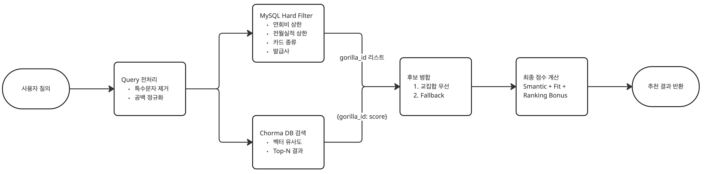
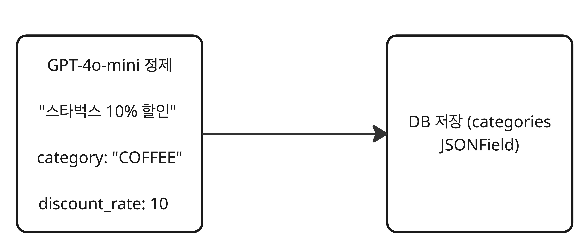

# 카드 추천 알고리즘 상세 설계

## 목차

1. [시스템 개요](#1-시스템-개요)
2. [아키텍처](#2-아키텍처)
3. [점수 산정 로직](#3-점수-산정-로직)
4. [설계 의사결정](#4-설계-의사결정)
5. [구현 상세](#5-구현-상세)
6. [카테고리 분류 체계](#6-카테고리-분류-체계)
7. [임베딩 파이프라인](#7-임베딩-파이프라인)
8. [성능 최적화](#8-성능-최적화)
9. [향후 개선 방향](#9-향후-개선-방향)

---

## 1. 시스템 개요

### 1.1 목표

사용자의 **자연어 질의**와 **소비 성향**을 종합적으로 분석하여 최적의 카드를 추천하는 하이브리드 추천 시스템

### 1.2 추천 방식

| 방식 | 설명 | 사용 시나리오 |
|------|------|--------------|
| **Hybrid** | 자연어(Semantic) + 선호도(Fit) + 인기도(Ranking) | "카페 자주 가는데 좋은 카드 추천해줘" |
| **Profile-based** | 선호도(Fit) + 인기도(Ranking) | 사용자 프로필 기반 자동 추천 |

### 1.3 핵심 컴포넌트
#### 하이브리드 추천


#### 프로필 기반 추천


---

## 2. 아키텍처

### 2.1 데이터 흐름


### 2.2 기술 스택

| 컴포넌트 | 기술 | 역할 |
|----------|------|------|
| 메인 DB | MySQL | 카드 정보, 하드 필터링 |
| 벡터 DB | ChromaDB | 임베딩 저장, 유사도 검색 |
| 임베딩 모델 | text-embedding-3-large | 카드 혜택 벡터화 |
| API 프록시 | GMS (OpenAI 호환) | 임베딩 API 호출 |

---

## 3. 점수 산정 로직

### 3.1 Hybrid Score 공식

```
Total Score = (0.50 × Semantic Score) + (0.50 × Fit Score) + Ranking Bonus
```

### 3.2 각 점수 요소 상세

#### Semantic Score (의미 유사도)

ChromaDB 벡터 검색 결과의 거리(distance)를 유사도로 변환:

```python
semantic_score = 1.0 / (1.0 + distance)
```

- **distance = 0**: 완벽히 일치 → score = 1.0
- **distance = 1**: 보통 유사 → score = 0.5
- **distance ↑**: 유사도 ↓

#### Fit Score (선호도 매칭)

사용자 선호 카테고리와 카드 혜택의 매칭도:

```python
def _calc_fit_score(card, category_weights):
    score = 0.0
    for cat in card.categories:
        score += category_weights.get(cat, 0)

    # 정규화 (0 ~ 1)
    denominator = sum(category_weights.values()) or 1.0
    return min(score / denominator, 1.0)
```

예시:
```
사용자 선호: {'COFFEE': 3, 'FOOD': 2, 'TRANS': 1}
카드 카테고리: ['COFFEE', 'SHOP']

Fit Score = 3 / (3+2+1) = 0.5
```

#### Ranking Bonus (인기도 보정)

카드고릴라 인기 순위 기반 소폭 가산점:

```python
ranking_bonus = max(0, (100 - ranking) / 1000.0)
```

- **1위 카드**: +0.099
- **50위 카드**: +0.050
- **100위 이상**: +0.000

### 3.3 가중치 선정 근거

| 가중치 | 값 | 근거 |
|--------|-----|------|
| Semantic | 0.50 | 사용자 질의 의도를 직접 반영 |
| Fit | 0.50 | 장기적 소비 패턴과의 정합성 |
| Ranking | 최대 0.1 | 동점자 구분용, 과도한 편향 방지 |

**설계 철학**: Semantic과 Fit을 동등하게 취급하여, 질의 의도와 소비 성향의 균형 유지

---

## 4. 설계 의사결정

### 4.1 Hard Filter vs Soft Penalty

#### 결정: Hard Filter 채택

**배경**:
- 초기에는 Soft Penalty 방식 적용 (조건 미충족 시 점수 감점)
- `_calc_penalty()`, `_calc_fee_penalty()` 메서드 구현

**문제점 발견**:
```python
# 기존 코드 (삭제됨)
def _calc_penalty(self, card, filters):
    # SQL에서 이미 필터링되어 항상 0 반환
    return 0.0  # 무의미한 연산
```

**해결**:
- SQL WHERE 절에서 하드 필터 적용
- 불필요한 패널티 로직 제거
- 코드 복잡도 감소, 성능 향상

```python
# 현재 구현
def _get_sql_candidates(self, filters):
    qs = Card.objects.all()

    if max_annual_fee:
        qs = qs.filter(annual_fee_min__lte=max_annual_fee)

    if max_min_spending:
        qs = qs.filter(min_spending__lte=max_min_spending)

    return list(qs.values_list('gorilla_id', flat=True))
```

### 4.2 교집합 vs 합집합 전략

#### 결정: 교집합 우선 + Fallback

**배경**:
- SQL 결과와 Chroma 결과를 어떻게 합칠 것인가?

**선택지 분석**:

| 전략 | 장점 | 단점 |
|------|------|------|
| 합집합 | 후보 많음 | 관련성 낮은 카드 포함 가능 |
| 교집합 | 정확도 높음 | 후보 부족 가능 |
| 교집합 + Fallback | 균형 | 구현 복잡 |

**최종 결정**:
```python
# 1. 교집합: Chroma 결과 중 SQL 필터 통과한 카드
for gid in chroma_candidates.keys():
    if gid in sql_candidates_set:
        final_gids.append(gid)

# 2. Fallback: 교집합 부족 시 SQL 후보에서 추가
if len(final_gids) < k * 3:
    for gid in sql_candidates:
        if gid not in seen_gids:
            final_gids.append(gid)
```

### 4.3 임베딩 모델 선택

#### 결정: text-embedding-3-large

**비교 분석**:

| 모델 | 차원 | 비용 | 성능 |
|------|------|------|------|
| text-embedding-ada-002 | 1536 | 낮음 | 보통 |
| text-embedding-3-small | 1536 | 낮음 | 좋음 |
| **text-embedding-3-large** | 3072 | 중간 | 최고 |

**선정 근거**:
- 금융 상품 특성상 정밀한 의미 구분 필요
- 카드 혜택 텍스트의 미묘한 차이 반영
- 비용 대비 정확도 향상 가치 있음

### 4.4 카테고리 분류 체계

#### 결정: 15개 카테고리 표준화

**배경**:
- 카드사마다 혜택 분류 방식 상이
- 통일된 기준 없이는 Fit Score 계산 불가

**해결**:
- GPT-4o-mini로 비정형 혜택 텍스트 정제
- 15개 표준 카테고리로 매핑

```python
CATEGORY_CHOICES = [
    ('TRANS', '교통'),
    ('COFFEE', '카페'),
    ('COMM', '통신'),
    ('FOOD', '음식'),
    ('SHOP', '쇼핑'),
    ('GAS', '주유'),
    ('UTIL', '공과금'),
    ('SUB', '구독'),
    ('PAY', '간편결제'),
    ('TRAVEL', '여행'),
    ('MART', '마트'),
    ('CULTURE', '문화'),
    ('MEDICAL', '의료'),
    ('EDU', '교육'),
    ('ETC', '기타'),
]
```

---

## 5. 구현 상세

### 5.1 RecommendHit 데이터 구조

```python
@dataclass
class RecommendHit:
    gorilla_id: int          # 카드 고유 ID
    score: float             # 최종 점수
    semantic_score: float    # 의미 유사도 점수
    fit_score: float         # 선호도 매칭 점수
    preview: str             # 혜택 미리보기
    reasons: List[str]       # 추천 이유
    name: str                # 카드명
    company: str             # 발급사
    ranking: Optional[int]   # 인기 순위
```

### 5.2 recommend() 메서드 흐름

```python
def recommend(self, query: str, k: int = 5, filters: Dict = None):
    # 1. SQL 하드 필터로 후보군 생성
    sql_candidates = self._get_sql_candidates(filters)

    # 2. Chroma 벡터 검색
    chroma_candidates = self._get_chroma_candidates(query, filters)

    # 3. 후보 병합 (교집합 우선)
    final_gids = self._merge_candidates(sql_candidates, chroma_candidates, k)

    # 4. DB에서 카드 상세 조회
    cards = Card.objects.filter(gorilla_id__in=final_gids)

    # 5. 점수 계산
    for card in cards:
        semantic = chroma_candidates.get(card.gorilla_id, {}).get('score', 0)
        fit = self._calc_fit_score(card, filters.get('category_weights', {}))
        total = 0.50 * semantic + 0.50 * fit

        if card.ranking:
            total += max(0, (100 - card.ranking) / 1000.0)

    # 6. 정렬 및 반환
    return sorted(scored, reverse=True)[:k]
```

### 5.3 recommend_by_profile() 메서드

Semantic Score 없이 Fit Score만으로 추천:

```python
def recommend_by_profile(self, filters: Dict, k: int = 10):
    # Semantic = 0, Fit만 사용
    total = fit_score

    if card.ranking:
        total += max(0, (100 - card.ranking) / 1000.0)
```

---

## 6. 카테고리 분류 체계

### 6.1 15개 표준 카테고리

| 코드 | 한글명 | 포함 혜택 예시 |
|------|--------|---------------|
| TRANS | 교통 | 대중교통, 택시, 고속버스 |
| COFFEE | 카페 | 스타벅스, 투썸, 메가커피 |
| COMM | 통신 | SKT, KT, LGU+, 알뜰폰 |
| FOOD | 음식 | 배달앱, 식당, 편의점 |
| SHOP | 쇼핑 | 백화점, 아울렛, 온라인몰 |
| GAS | 주유 | 주유소, 충전소 |
| UTIL | 공과금 | 전기, 가스, 수도, 관리비 |
| SUB | 구독 | 넷플릭스, 유튜브, 멜론 |
| PAY | 간편결제 | 네이버페이, 카카오페이 |
| TRAVEL | 여행 | 항공, 호텔, 렌터카 |
| MART | 마트 | 이마트, 홈플러스, 코스트코 |
| CULTURE | 문화 | 영화, 공연, 전시 |
| MEDICAL | 의료 | 병원, 약국, 건강검진 |
| EDU | 교육 | 학원, 온라인강의 |
| ETC | 기타 | 분류 불가 혜택 |

### 6.2 카테고리 매핑 프로세스



---

## 7. 임베딩 파이프라인

### 7.1 텍스트 구성

각 카드는 다음 정보를 조합하여 벡터화:

```python
embedding_text = f"""
카드명: {card.name}
발급사: {card.company}
카드종류: {card.card_type}
연회비: {card.annual_fee_min}원
전월실적: {card.min_spending}원

혜택 요약: {card.benefits_summary}

카테고리별 혜택:
{category_benefits_detail}
"""
```

### 7.2 ChromaDB 동기화

```bash
# 전체 동기화
python manage.py sync_chroma --all

# 변경분만 동기화
python manage.py sync_chroma --updated
```

### 7.3 메타데이터 구조

```python
metadata = {
    'gorilla_id': card.gorilla_id,
    'name': card.name,
    'company': card.company,
    'card_type': card.card_type,
    'ranking': card.ranking,
    'annual_fee_min': card.annual_fee_min,
    'min_spending': card.min_spending,
    'categories': card.categories,  # ['COFFEE', 'TRANS', ...]
}
```

---

## 8. 성능 최적화

### 8.1 쿼리 최적화

#### N+1 문제 해결

```python
# Before: N+1 쿼리 발생
for gid in final_gids:
    card = Card.objects.get(gorilla_id=gid)  # N번 쿼리

# After: 단일 쿼리
cards = Card.objects.filter(gorilla_id__in=final_gids)
card_map = {c.gorilla_id: c for c in cards}  # 1번 쿼리
```

#### 인덱스 활용

```sql
-- cards_card 테이블 인덱스
CREATE INDEX idx_gorilla_id ON cards_card(gorilla_id);
CREATE INDEX idx_ranking ON cards_card(ranking);
CREATE INDEX idx_annual_fee ON cards_card(annual_fee_min);
```

### 8.2 캐싱 전략

```python
class CardRecommendService:
    def __init__(self):
        self._embeddings = None  # Lazy loading
        self._store = None       # Lazy loading

    @property
    def embeddings(self):
        if self._embeddings is None:
            self._embeddings = OpenAIEmbeddings(...)
        return self._embeddings
```

### 8.3 파라미터 튜닝

```python
# 환경 변수로 조절 가능
RECOMMEND_CHROMA_TOP_N = 100  # Chroma 검색 결과 수
RECOMMEND_SQL_TOP_N = 200     # SQL 후보군 크기
```

---

## 9. 향후 개선 방향

### 9.1 개인화 강화

- 사용자 결제 이력 분석
- 시간대별 소비 패턴 반영
- 연령/직업군별 추천 가중치 조정

### 9.2 실시간 피드백 반영

- 추천 결과 클릭률(CTR) 수집
- A/B 테스트로 가중치 최적화
- 강화학습 기반 추천 모델 도입

### 9.3 설명 가능한 AI

- 추천 이유 상세화
- 카테고리별 매칭 점수 시각화
- "왜 이 카드인가?" 자연어 설명 생성

---

## 소스 코드

- **소스 코드**: `backend/cards/services/recommend.py`
- **데이터 파이프라인**: `analyze_card/benefit_refine_data.py`
- **ChromaDB 동기화**: `backend/cards/management/commands/sync_chroma.py`
